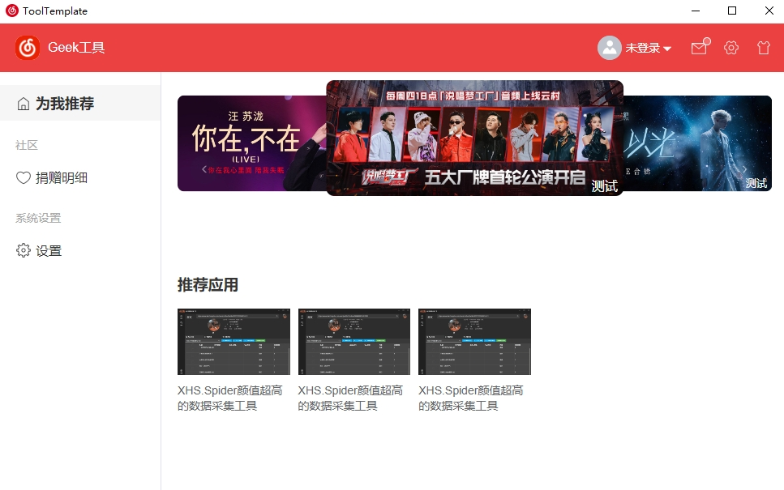
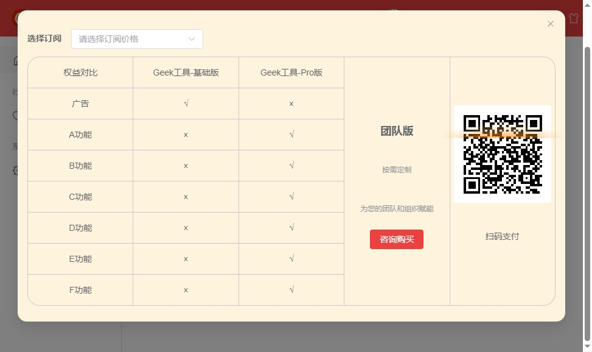
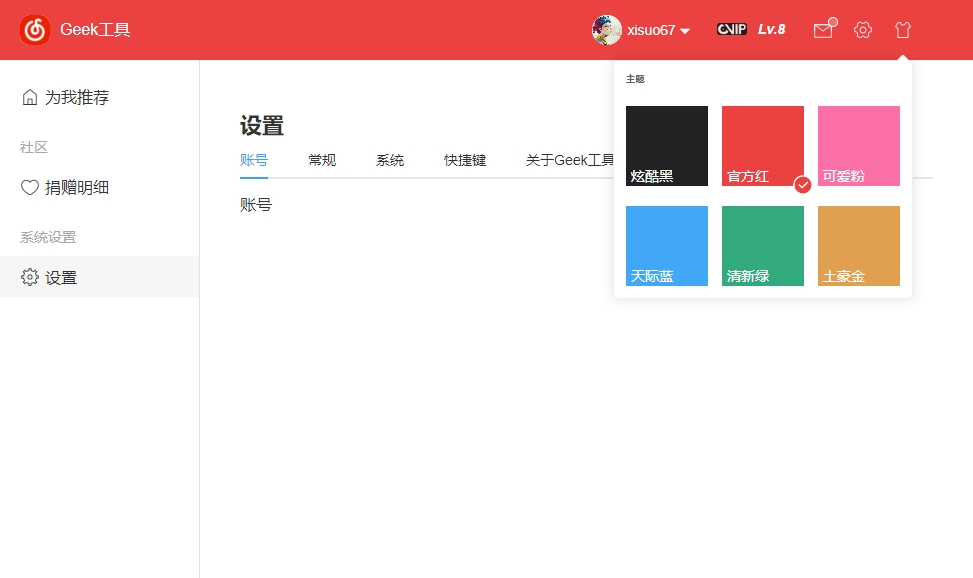

<p align="center">
  <a href="https://github.com/xisuo67/Wails-Tool-Template">
  </a>
</p>
<h1 align="center">Wails-Tool-Template</h1>

<div align="center">
    <p align="center">
    <a href="https://github.com/xisuo67/Wails-Tool-Template/stargazers" style="text-decoration:none" >
        
    </a>
    <a href="https://github.com/xisuo67/Wails-Tool-Template/network" style="text-decoration:none" >
        
    </a>
    <a href="https://github.com/xisuo67/Wails-Tool-Template/issues" style="text-decoration:none">
        
    </a>
    <a href="https://github.com/xisuo67/Wails-Tool-Template/blob/vue3-template/LICENSE.txt" style="text-decoration:none" >
        
    </a>
</p>
</div>


<table>
    <tr>
        <td></td>
        <td></td>
    </tr>
    <tr>
        <td></td>
        <td></td>
    </tr>
        <tr>
        <td></td>
        <td></td>
    </tr>
</table>

## 说明

> 这是一个基于wails的跨平台开箱即用的桌面客户端解决方案，同时是一个仿网易云的客户端，旨在开箱即用，所有数据均使用mock数据
>
> 前端基于 Vue3+TypeScript+Vite+eletement-plus
>
> 由于前端拉跨，很多地方都写的不是很好，如果可以，也希望更多的人能参与到这个项目中

## 如何运行

1、Build Environment

- Node.js [link](https://nodejs.org/en)
- pnpm ：`npm i -g pnpm`
- Go [link](https://go.dev/)
- Wails [link](https://wails.io/) ：`go install github.com/wailsapp/wails/v2/cmd/wails@latest`

2、Pull and Build

```bash
git clone https://github.com/xisuo67/Wails-Tool-Template.git

cd Wails-Tool-Template

wails build
```

